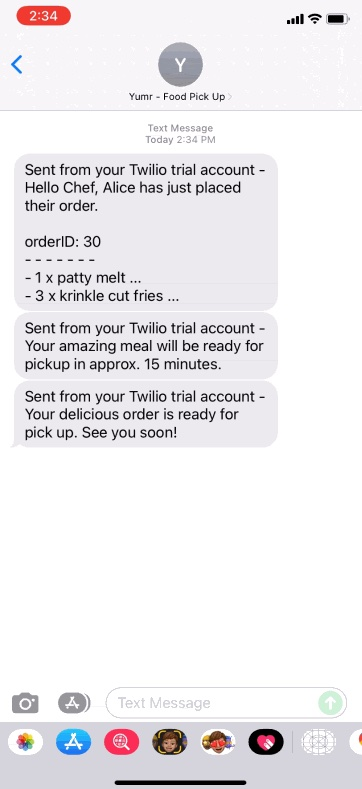

# YUMRs

---

## The Food Ordering App

YUMRs is a web application that allows a user to login and order food, and receive SMS text notifications on the status of their order. There is also a UI for the restaurant side, to update their customer on the status of their order via SMS.

This project is for educational purposes only. Enjoy!


<!-- 

 -->



## Getting Started

1. create a [twilio](https://www.twilio.com/try-twilio) free trial account
2. in your .env file add the following:

```
# Twilio authentication keys:

TWILIO_ACCOUNT_SID=[your_sid]
TWILIO_AUTH_TOKEN=[your_token]
PHONE_TWILIO=+1[your_twilio_number]
PHONE_RECIEVE=+1[your_twilio_number]
PHONE_RESTAURANT=+1[your_phone_number]

# psql connection:

DB_HOST=localhost
DB_PORT=5432
DB_USER="your psql username"
DB_PASS="your database password"
DB_NAME="your database name"
```

3. in 01_users.sql (in the seeds folder) edit the file to have your own phone number, world format, no spaces: +1[areacode][phone number]
4. in your terminal run `npm run db:reset`
5. when logging in enter `Alice` or `Raymond`
6. now you will recieve text alerts to your phone number from twilio

## Dependencies

- chalk
- cookie-session
- dotenv
- ejs
- express
- morgan
- pg
- sass
- twilio
